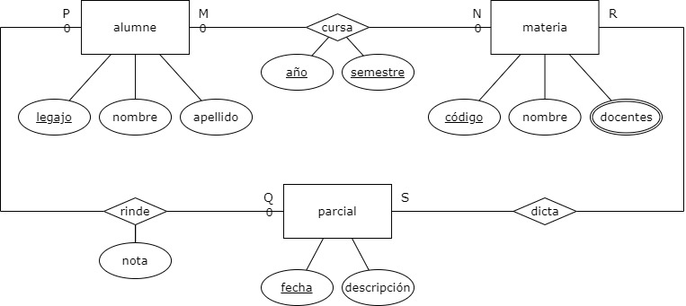

= Mini Guía de MongoDB
Ximena Ebertz <xxx>
v2, {docdate}
:title-page:
:numbered:
:toc-title: Contenidos
:toc: left
:tabsize: 4
:icons: font
:source-highlighter: coderay
:note-caption: Nota
:figure-caption: Figura
:table-caption: Tabla
:pdf-page-size: A4
:pdf-page-margin: [3cm, 3cm, 3cm, 3cm]

[small]#Copyright (C) 2023 Ximena Ebertz. All rights reserved.#

En este documento, presentamos una introducción a la sintaxis de la base de datos documental MongoDB. Para cada ejemplo, presentamos la query _input_ y el _output_ dado por el gestor de base de datos.

Se utilizará el siguiente diagrama de entidad-relación como punto de partida.

== Diseño

A diferencia de las bases de datos relacionales, para diseñar una base de datos no relacional se necesita más información que únicamente el DER.

En particular, una base de datos documental como MongoDB se puede diseñar en base al DER y a las principales consultas que se realizarán sobre la base de datos. Esto es porque las bases de datos no relacionales están diseñadas para clusterizarse, por lo que la información se encuentra distribuida en distintos nodos de un cluster.

Si la información a obtener para una consulta recurrente no se encuentra en un mismo nodo, las operaciones pueden ralentizarse y la información puede estar desactualizada. Por este motivo, el diseño de colecciones y documentos debe realizarse pensando en los puntos principales para los que se creó la base de datos. De esta forma, obtenemos consultas más rápidas y eficaces.

En este caso, las principales consultas que definimos, a modo de ejemplo, son las siguientes:

1. Obtener los estudiantes que cursan una materia determinada
2. Obtener los estudiantes que desaprobaron algún parcial
3. Materias cursadas por un estudiante en el año 2015
4. Obtener los docentes que dictan una materia

// ! definir dónde explico el concepto de colección: slide o guía?
El diseño se puede presentar mediante los nombres de las colecciones, y un documento de ejemplo de cada colección. En este caso, podemos tener en cuenta las colecciones `alumnes` y `materias`, con documentos que siguen la siguiente estructura:

//ver si es mejor poner new Date(anio, mes, dia)
[source, JSON]
----
alumne {
    "_id": 37627821, 
    "nombre": "Juan",
    "apellido": "Perez",
    "materia_cursada": {
        "cod": 1,
        "nombre": "Bases de Datos I",
        "anio": 2024,
        "semestre": 1,
        "parciales": [
            {
                "fecha": {"$date": "2024-01-01T00:00:00Z"},
                "nota": 8 
            },
            { 
                "fecha": {"$date": "2024-02-01T00:00:00Z"},
                "nota": 9
            }
        ]
    }
}

materia {
    "_id": 1,
    "nombre": "Bases de Datos I",
    "docentes": ["Bertaccini, Daniel", "Ebertz, Ximena", "Rondelli, Hernán"],
    "parciales": [
        {
            "fecha": {"$date": "2024-01-01T00:00:00Z"},
            "descripcion": "Primer Parcial"
        },
        {
            "fecha": {"$date": "2024-02-01T00:00:00Z"},
            "descripcion": "Segundo Parcial"
        }   
    ]
}
----

Se puede ver que, en este caso, se tiene el el documento del alumne el código de la materia cursada y su nombre. El código es el campo `_id` del documento de la materia, por lo que el programador debe mantener la coherencia del campo `cod` cuando inserta nuevos alumnes. Este tipo de referencia se denomina *referencia manual*, y es la manera más sencilla de referenciar.

Por otra parte, podemos ver que cada alumno tiene la información de una materia cursada. Por lo que, en la colección `alumnos`, existirá un documento por cada materia del alumno.

Almacenar el nombre de la materia en el documento del alumno es una decisión de diseño. No es necesario, ya que con el código se puede obtener, pero es mejor aprovechar la redundancia y la desnormalización, para que las consultas finales sean lo más sencillas posibles.

== Crear base de datos

.... conexión con atlas?''

Para crear una base de datos, únicamente se debe usar la ... `use nombreDB`.

----
xime> use coso
----

== Insertar datos

Existen diversas formas de insertar datos.

----
insert one
----

----
insert many
----

----
insert many from document (modificar segun SO)
----

MENCIONAR QUE MONGODB ES BASADA EN JS Y ADMITE CODIGO JS

show collections

== Selección

=== Find

db.coleccion.find()
db.coleccion.find({query})
db.coleccion.find({query}, {columnas})

db.coleccion.findOne()

=== Sort

=== Count

== Update

updateOne
updateMany

$set y $unset

== Comparación

$eq $gt $gte $in $lt $lte $ne $nin

== Operadores lógicos

$and $not $nor $or $exists

== Array

== Set

== Map

== Eliminar datos

=== Eliminar documentos

db.coleccion.remove({query})

=== Eliminar coleccion

db.coleccion.drop()